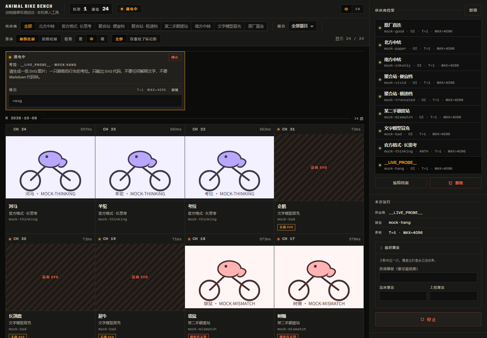

# 动物骑单车测试台 · Animal Bike Bench

[](LICENSE)
[](#它不做什么)
[](#支持的协议)

**同一个 `claude-sonnet-4-5`，在 A 家画出一只像样的鹈鹕，在 B 家只回一句「我画不了」，在 C 家画得挺好、但响应体里回显的是另一个模型名。**

这个工具把这些事看见，并留下证据。

每次运行随机抽一道题，让模型输出一张「骑着自行车的某动物」的 SVG。不评分、不排名 ——
结果按时间沉淀成一本标本册，判断留给人的眼睛。



*一次运行 = 一条记录。左边是作品墙，右边是供应商档案与本次运行设置。*

---

| | |
| --- | --- |
| **要回答的问题** | 同一个模型名，换个供应商，还画得出来吗 |
| **怎么回答** | 一题一图，原样留存，只贴可复现的事实标签 |
| **不做什么** | 不打分、不排名、不请 LLM 当裁判、不并发跑分、不上云 |
| **技术栈** | Node.js + Express + React 18 + Vite + TypeScript |
| **界面语言** | 中文 / English |

## 它不做什么

边界决定了这个工具长什么样：

| 不做 | 因为 |
| --- | --- |
| 打分、排名、LLM 当裁判 | 任何看起来像分数或胜负的视觉语言都是越界 |
| 批量并发跑分 | 一次一道题、一家供应商；横向对比靠事后翻画廊 |
| 账号、多用户、云部署 | 永远只服务一台机器上的一个人 |
| 替模型补台面 | 背景由模型自己的 SVG 决定，工具不统一底色 |

它不是评测平台，是一张工作台加一本标本册。

## 快速开始

需要 Node.js 20 或更高版本。

```bash
npm install
npm run dev
```

| 服务 | 地址 |
| --- | --- |
| 前端 | http://127.0.0.1:5174 |
| 后端 | http://127.0.0.1:8787（前端已代理 `/api`） |

打开页面，在右栏新增供应商（协议 + 接口地址 + 密钥），**再选一个模型名**，点「开始生成」。

> [!TIP]
> Windows 上可以直接双击 **`启动.bat`**。它会自动装依赖、缺前端产物就 build、检测端口占用，
> 然后单进程起在 http://127.0.0.1:8787。`启动.bat dev` 是带热刷新的开发模式。

## 用法

### 供应商档案里没有「模型名」这一栏

添加供应商只填名称、协议、接口地址、密钥、默认参数。模型名是**每次运行现场选的必填项**。

> [!IMPORTANT]
> 这是刻意的。工具唯一要回答的问题是「**同一个模型名**在不同供应商名下表现如何」，
> 把模型名存进档案，等于让每家自带一个被测量，横向对比当场失效。

### 参数的三个层次

`全局默认 → 供应商覆盖 → 本次运行覆盖`，后者压前者。

`max_tokens` 全局默认 **32000**，是当作「放开思考」用的，不是算出来的数 —— [OI] 兼容协议里
这**一个**数同时管思考链和正文，8192 会在模型还在想的时候就把额度用光。

> [!NOTE]
> 供应商那层**留空即跟随全局默认**。别每家抄一遍，否则改全局不会生效。

### 思考强度

六档 `minimal / low / medium / high / xhigh / max`，默认 `high`，按协议换算：

- `openai` —— 原样发 `reasoning_effort`。实测上游会校验这个字段，编造的值稳定返回 400。
- `anthropic` —— 换算成 `thinking.budget_tokens`（1024 / 2048 / 4096 / 8192 / 12288 / 16000，
  1024 是官方硬下限），并把 temperature 强制成 1，代价是 `top_p` 永远不会被发出去。

> [!WARNING]
> Anthropic 那张换算表**没有实测过**（手上没有 Anthropic 的 key）。`openai` 那张是实测的。

档位在真实负载上分得开，但幅度温和：实测同一道题 `minimal → max`，思考字符 **+61%**、
总输出 token **+45%**、耗时 **+39%**。

## 支持的协议

只有两种。

| 协议 | 端点 | 鉴权头 |
| --- | --- | --- |
| `openai`（[OI] 兼容） | `POST {baseUrl}/v1/chat/completions` | `Authorization: Bearer <key>` |
| `anthropic`（Messages） | `POST {baseUrl}/v1/messages` | `x-api-key: <key>` + `anthropic-version: 2023-06-01` |

`baseUrl` 填到根即可（如 `https://api.example.com`），路径由程序拼。

## 标签

判定不靠 LLM 裁判，全是可复现的事实。**只要挂了任何一个标签，`ok` 就是 false** ——
换模型、截断正是要抓的降智信号，不能让它们显示成正常。

| 标签 | 含义 |
| --- | --- |
| `not-svg` | 输出里根本没有可用的 SVG（典型：模型说「我画不了」） |
| `truncated` | SVG 没闭合，或 `finish_reason` 是 `length` / `max_tokens` |
| `model-mismatch` | 响应体里的 `model` 与请求不一致 —— **最值得警惕的偷换模型信号** |
| `render-failed` | 抽出来的 SVG 解析不过，浏览器渲染不出来 |
| `http-error` | 上游返回错误状态码 |
| `timeout` | 超过设定的超时秒数 |
| `aborted` | 手动点了停止 |

大小写差异（请求 `Claude-Sonnet-4-5` 返回 `claude-sonnet-4-5`）不算不符，不会误报。

告警只有两档，同一套语义贯穿画面、指示灯、异常标签三处：

- **红灯** —— 请求根本没拿到东西：`http-error`、`timeout`、`render-failed`。
- **琥珀灯** —— 拿到了但有毛病：`not-svg`、`truncated`、`model-mismatch`、`aborted`。
- **橄榄绿灯** —— 干净跑完，一个标签都没有。**熄灭**只出现在「这一格还没跑过」的时候。

红留给「请求压根没通」，其余一律降一档，**不让告警盖过画本身**。

## 运行行为

- 超时默认 **120 秒**，按次算；超时算失败，计入重试。
- 重试默认 **1 次**（最多尝试 2 次），失败后按 0.5s / 1s / 2s… 退避，上限 4 秒。
- **无论成功、失败还是中止，都会落盘一条记录。** 中止时保存已收到的部分并打 `aborted`，
  不会白跑一趟。运行中通过 SSE 实时显示代码与思考过程，结束后渲染最终 SVG。

## 数据落在哪

题池写在 `prompts.json`，改了不用重启（每次运行都重新读）：

```json
{
  "animals": ["鹈鹕", "水豚", "鸭嘴兽"],
  "template": "请生成一张 SVG 图片：一只骑着自行车的{animal}。只输出 SVG 代码，不要任何解释文字，不要 Markdown 代码块。",
  "templateEn": "Generate an SVG image of a {animal} riding a bicycle. ...",
  "extras": [
    { "id": "bicycle-only", "label": "一辆自行车（无动物）", "text": "请生成一张 SVG 图片：一辆自行车。..." }
  ]
}
```

`{animal}` 是占位符，`animals` 里加一个名字就多一道题（出厂 20 只），`extras` 放不成组的散题。
题目语言在右栏切（`promptLang`）。想每次都画同一只动物，把 `animals` 临时改成只有一项即可。

结果全在本地文件目录里，人可以读、可以 git、可以手工备份：

```
data/records/2026-10-06/
  20261006-211451-8x5hr.json           # 元数据 + 标签
  20261006-211451-8x5hr.svg            # 抽出来的 SVG
  20261006-211451-8x5hr.raw.txt        # 完整原始响应（按开关）
  20261006-211451-8x5hr.reasoning.txt  # 思考过程（按开关）
```

目录写在 `config.json` 的 `dataDir`（相对路径按项目根解析，不依赖启动目录）。

> [!IMPORTANT]
> **API Key 单独存在 `config.local.json`**，它已被 `.gitignore` 挡掉。
> `config.json` 不含密钥，适合提交。

**渲染安全** —— 模型输出当不可信内容处理。落盘的原始 SVG 原样保留；所有真正拿去渲染的地方
先过 `sanitizeSvg`（去掉 `<script>` / `<foreignObject>` / `on*` 事件属性 / 非 `#` 开头的外链
`href` / `javascript:`）。缩略图走 ``（加载 SVG 不执行脚本），详情大图走 `sandbox=""`
且不给 `allow-scripts` 的 iframe，外加一层内联 CSP。整个 SVG 渲染面不允许任何外部请求。

## 项目结构

```
.
├─ server/                 Express 后端
│  ├─ index.ts             路由与 SSE（/api/config、/api/providers、/api/run、/api/records…）
│  ├─ runner.ts            一次运行：抽题 → 请求 → 判定 → 落盘（含重试与中止）
│  ├─ config.ts            config.json / config.local.json 的读写与清洗
│  ├─ storage.ts           data/records/ 的读写与编号分配
│  ├─ prompts.ts           题库读取与抽题
│  ├─ svg.ts               SVG 抽取与校验（服务端）
│  └─ chat/                协议适配层：openai.ts / anthropic.ts / types.ts
├─ shared/                 前后端共享
│  ├─ types.ts             RunRecord · AppConfig · FlagCode · RunEvent · 出厂默认值
│  └─ svg.ts               sanitizeSvg：渲染前的清洗
├─ web/                    React + Vite 前端
│  ├─ src/App.tsx          顶栏 + 筛选 + 画廊 + 右栏
│  ├─ src/i18n.ts          中英文案（文案必须走 key，禁止硬编码）
│  ├─ src/components/      ControlPanel / Rack / SpecimenSheet / LiveBay / BusBar …
│  └─ src/lib/svgCheck.ts  前端 SVG 可解析性检查
├─ docs/                   README 用的界面截图
├─ prompts.json            题池（可随时改，不用重启）
├─ config.json             出厂配置（可提交；不含 API Key）
└─ config.local.json       本机 API Key（已 gitignore，绝不入库）
```

打包成单进程：`npm run build` 产出 `dist/web`，`npm start` 同时提供前端和 API，
端口用 `PORT` 环境变量指定（默认 8787）。

## 已知限制

**随机抽题 + 不重跑同题，意味着各家画的是不同的动物。** 单次结果的差异不能直接归因于供应商，
要得出可信结论只能靠长期累积 —— 画企鹅比画章鱼难看，是题目难度问题，不是模型降智。

> [!WARNING]
> **深色背景会吃掉一部分画。** 背景由模型的 SVG 自己决定，工具不替它补台面。所以一只用深色
> 描边、又没画底色的动物，在深色记录区里几乎看不见 —— 而它**不会**被标记成异常，因为它确实
> 画出了合法的 SVG。这是「原样留存优先于整洁」的代价：真要看清楚，打开详情页（那里同样是它
> 自己的背景），或者看 SVG 源码。界面上会明确指出这是「没画背景」，而不是含糊过去。

**原样留存优先于整洁。** 哪怕回来的是废话、半截标签、别人的模型名，也原封不动留着 ——
被清洗过的证据没有举证价值。清洗只作用于「渲染给人看」的那一层，源码层永远可回溯。

不做账号、不多用户、不联网部署，就是个本机自用的工具。

## English

**Animal Bike Bench** is a local-only workbench for the one question provider shopping actually
raises: *is this provider serving me the model it claims to?*

You register a provider (base URL + key — deliberately **no model name**), then pick a model name
per run. Each run draws one random prompt from `prompts.json` asking the model to output an SVG of
some animal riding a bicycle. Raw output is stored verbatim and shown in a gallery, tagged with
reproducible, factual flags:

`not-svg` · `truncated` · `model-mismatch` (the strongest substitution signal) · `render-failed` ·
`http-error` · `timeout` · `aborted`

There is no scoring, no LLM judge, no leaderboard, no accounts, no cloud. Two protocols only
(OpenAI-compatible `/v1/chat/completions` and Anthropic `/v1/messages`). Because prompts are random
and never re-run, **a single pair of images is not a fair comparison** — only accumulated samples
are. Bilingual UI, dark theme, keyboard-navigable, WCAG AA body contrast.

Requires Node.js 20+. `npm install && npm run dev`, then open http://127.0.0.1:5174.
