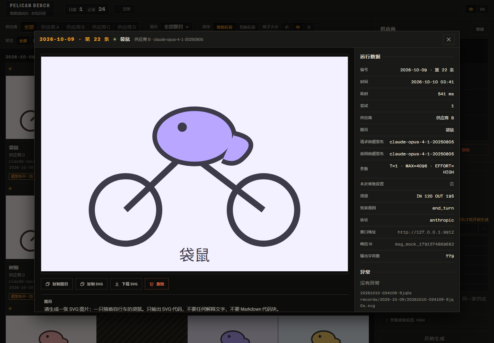
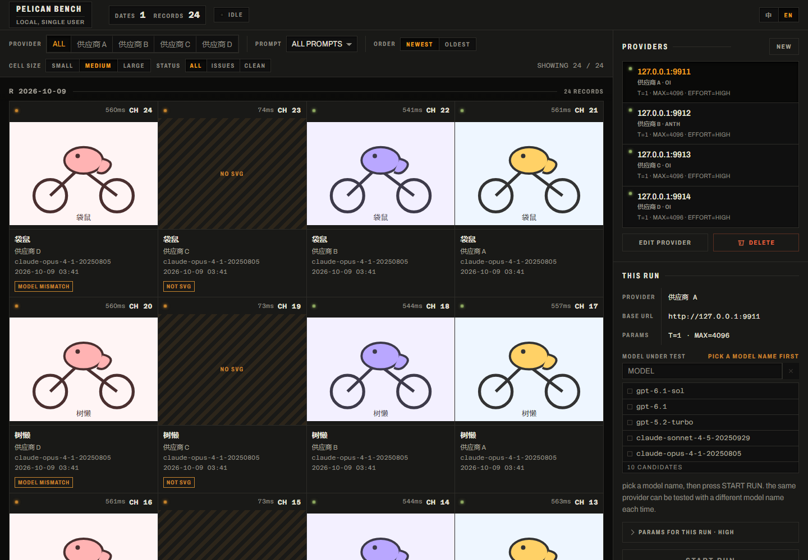

# 动物骑单车测试台 · Animal Bike Bench

[](LICENSE)
[](#它不做什么)
[](#两条协议)

**把一个模型名发给不同供应商，看谁画得溃不成军。**

同一个 `claude-sonnet-4-5`，在 A 家画出一只像样的鹈鹕，在 B 家只回一句「我画不了」，
在 C 家画的挺好但响应体里回显的是另一个模型名 —— 这个工具就是用来把这类事**看见并留下证据**的。

每跑一次，随机从题库里抽一道题（鹈鹕只是其中一只动物），让它输出一张「骑着自行车的某动物」的 SVG。
结果不评分、不盲评、不排名，全部按时间沉淀成一本标本册，判断留给人的眼睛。


<p align="center"><em>一次运行 = 一条记录。左边是作品墙，右边是供应商档案与本次运行设置。</em></p>

*A local-only workbench for comparing the **same model name** across different API providers.
One prompt, one SVG, no scoring — just raw output, kept verbatim, with factual flags for
truncation, model substitution and hard failures. Chinese/English UI. See [English summary](#english-summary).*

---

## 它不做什么

先把边界说清楚，因为它决定了这个工具长什么样：

- **不打分、不排名、不请 LLM 当裁判。** 任何看起来像分数或胜负的视觉语言都是越界。
- **不做批量并发跑分。** 一次运行只抽一道题、只打一家供应商，横向对比靠事后翻画廊。
- **不做账号、不多用户、不云部署。** 它永远只服务一台机器上的一个人。
- **不替模型补台面。** 画面的背景由模型自己的 SVG 决定，工具不统一底色（见 [已知限制](#已知限制)）。

结果是：它不是评测平台，是一张工作台加一本标本册。

## 快速开始

```bash
npm install
npm run dev
```

- 前端 http://127.0.0.1:5174
- 后端 http://127.0.0.1:8787（前端已代理 `/api`）

打开页面，在右栏新增一个供应商（协议 + 接口地址 + 密钥），**再选一个模型名**，点「开始生成」。

Windows 上也可以直接双击 **`启动.bat`**：它会自动 `npm install`、缺前端产物就 `npm run build`、
检测端口占用，然后单进程起在 http://127.0.0.1:8787。
`启动.bat dev` 则是带热刷新的开发模式。

## 界面



<p align="center"><em>点开任意一格进详情页：大图为主，右边是全部运行数据与异常明细。</em></p>

界面里没有行话。几个词固定这么用：

- **一次运行 = 一条记录。** 记录按天分组，分组头就是日期（`2026-10-06`）。
- **编号 = 第几号。** 形如 `2026-10-06 · 第 07 条`，是引用某一次运行时用的坐标（见下）。
- **供应商** = 接口地址 + 密钥，配好的一份连接 —— **不含模型名**。
- **异常** = 这次运行挂了标签（截断、模型名不符之类）。
- **详情页** = 点开一条记录后看到的大图与全部数据。

- **顶栏**：日期数、记录数、运行状态（空闲 / 运行中）、中英文切换；右端还有一栏，
  跑的时候显示正在运行的这次请求，跑完显示最近一次（`第 07 条 · 鹈鹕 · 原厂直连 · 557ms`）。
- **筛选条**：供应商、题目、排序（新的在前 / 旧的在前）、格子大小（小 / 中 / 大）、只看有异常的。
  改过筛选后可一键重置。
- **记录区**：按天分组，每天一条带日期的分组头。每格上方是左上角的指示灯、耗时、
  右上角的 `第 07 条` 编号；中间是画面；下面一行：动物 / 供应商 / 模型名 /
  **日期与时刻** / 异常标签。**点任意一格打开详情页。**
  （日期刻意留在格子里而不只放在分组头上：分组头是粘性的，单独截一格发出去时不会被一起截走。）
- **右栏**：供应商列表（协议、接口地址、API 密钥、temperature、maxTokens、思考强度），
  本次运行单独设置（临时改模型名或参数，只影响这一次，实际用到的值会记进结果；
  切换供应商时自动清空，避免串味），全局设置（题目语言、超时、重试、保存思考 / 完整原始响应、
  模型候选清单、文件位置）。

详情页左边是画面与操作（复制题目 / 复制 SVG / 下载 SVG / 删除），下面是题目与折叠块
（SVG 源码 / 思考过程 / 完整原始响应），右边一列是全部运行数据与异常明细。Esc 关闭。

英文界面：



### 编号是永久的

每条记录有一个**永久编号**，中文界面写作 `2026-10-06 · 第 07 条`
（英文界面是 `R 2026-10-06 / CH 07`）。它在你引用某一次运行时使用，
不随筛选、排序、格子大小变化。删掉中间某条不会让后面的重新编号 —— **空出来的号就空着**，
这样你之前截的图、记下的坐标永远还指向同一件作品。

## 核心设计取舍

有四条决定，理解了它们就理解了这个工具为什么长这样。

### 1. 供应商档案里不存模型名

添加供应商时只填**名称、协议、接口地址、密钥、默认参数 —— 不填模型名**。
模型名是每一次运行现场选的必填项，不选则不能开始生成。

理由：这个工具唯一要回答的问题是「**同一个模型名**在不同供应商名下表现如何」。
把模型名存进档案，就等于让每一家自带一个被测量，横向对比当场失效。

### 2. 诚实地承认比较是不公平的

每次随机抽题、同题不重跑，所以单次的两张图本来就画的是不同动物 ——
画企鹅比画章鱼难看，是题目难度的问题，不是模型降智。

界面上因此不能假装它们可以一决高下（不给并排对比、不给胜负暗示）。
**累积的样本量才是可信度的来源**：同一个模型名在 A 家和 B 家各跑几十次，
再看谁的异常标签多、谁的图普遍更敷衍。

### 3. 标签记录事实，不记录好坏

渲染失败 / 非 SVG 输出 / 疑似截断 / 模型名不符 / HTTP 错误 / 超时 / 已中止 ——
这些标签只陈述**发生了什么**，不陈述好坏。挂上任意一个标签即不算干净成功。

### 4. 原样留存优先于整洁

回来的东西哪怕是一坨废话、半截标签、别人的模型名，也原封不动地留着 ——
**被清洗过的证据没有举证价值**。清洗只作用于「渲染给人看」的那一层，源码层永远可回溯。

## 两条协议

| 协议 | 端点 | 鉴权头 |
| --- | --- | --- |
| `openai`（[OI] 兼容） | `POST {baseUrl}/v1/chat/completions` | `Authorization: Bearer <key>` |
| `anthropic`（Messages） | `POST {baseUrl}/v1/messages` | `x-api-key: <key>` + `anthropic-version: 2023-06-01` |

`baseUrl` 填到根就行（例如 `https://api.example.com`），路径由程序拼。仅此两种协议。

### 思考强度

**思考强度**是每次运行的设置，六档 `minimal / low / medium / high / xhigh / max`，默认 `high`
（出厂值写在 `config.json` 的 `defaultParams.effort`）。两种协议各按自己的方式表达它：

- `openai`：原样发 `reasoning_effort`。实测上游会校验这个字段 —— 编造的值稳定返回 400。
- `anthropic`：按档位换算 `thinking.budget_tokens`（`minimal` 1024 / `low` 2048 / `medium` 4096 /
  `high` 8192 / `xhigh` 12288 / `max` 16000，1024 是官方硬下限），并按官方要求把 temperature
  强制成 1。**这张换算表没实测过**（手上没有 Anthropic 的 key），`openai` 那张是实测的。
  注意由此带来的后果：Anthropic 协议下 `top_p` 永远不会被发出去。

档位在真实负载上确实分得开，但幅度温和 —— 实测同一道题 `minimal → max`：
思考字符 **+61%**、总输出 token **+45%**、耗时 **+39%**。它不是数量级开关。

### 参数的三个层次

`全局默认 → 供应商覆盖 → 本次运行覆盖`，后者压前者。

- `max_tokens` 全局默认 **32000**，是当作「放开思考」用的，不是算出来的数：
  [OI] 兼容协议里这**一个**数同时管思考链和正文，8192 会在模型还在想的时候就把额度用光
  （实测有两条记录 8192 全花在思考上、正文一个字都没吐出来）。
- **供应商那层留空 = 跟随全局默认** —— 表单里留空就行，别每家抄一遍，
  否则改全局默认不会生效。

## 自动打的标签

判定不靠 LLM 裁判，全是可复现的事实：

| 标签 | 含义 |
| --- | --- |
| `not-svg` | 输出里根本没有可用的 SVG（典型：模型说「我画不了」） |
| `truncated` | SVG 没闭合，或 `finish_reason` 是 `length` / `max_tokens` |
| `model-mismatch` | 响应体里的 `model` 和请求的不一致 —— **最值得警惕的偷换模型信号** |
| `render-failed` | 抽出来的 SVG 解析不过，浏览器渲染不出来 |
| `http-error` | 上游返回错误状态码 |
| `timeout` | 超过设定的超时秒数 |
| `aborted` | 手动点了停止 |

规则：**只要挂了任何一个标签，`ok` 就是 false。** 换模型、截断这些正是要抓的降智信号，
不能让它们在记录区里显示成正常。大小写差异（请求 `Claude-Sonnet-4-5` 返回 `claude-sonnet-4-5`）不算不符，不会误报。

### 告警只有两档

而且同一套语义贯穿画面、指示灯、异常标签三处：

- **红灯** = 这次请求根本没拿到东西：`http-error`、`timeout`、`render-failed`。
- **琥珀灯** = 拿到了但有毛病：`not-svg`、`truncated`、`model-mismatch`、`aborted`。
- **橄榄绿灯** = 干净跑完，一个标签都没有。**熄灭**只出现在「这一格还没跑过」的时候。

这么分是有意的：红留给「请求压根没通」，其余一律降一档，**不让告警盖过画本身**。
一格里不会出现「画面是红的、异常标签是琥珀」这种自相矛盾。

## 超时、重试与中止

- 超时默认 120 秒，按次算；超时算失败，计入重试。
- 重试次数默认 1（也就是最多尝试 2 次），失败后按 0.5s / 1s / 2s… 退避，上限 4 秒。
- **无论成功、失败还是中止，都会落盘一条记录。** 中止时把已经收到的部分保存下来并打 `aborted`，
  不会白跑一趟。运行中通过 SSE 实时显示代码与思考过程，结束后渲染最终 SVG。

## 渲染安全

模型输出当不可信内容处理，两层防护：

1. 落盘的原始 SVG 原样保留（方便「看源码」追溯到底吐了什么）；
2. 所有真正拿去渲染的地方，都先过 `sanitizeSvg` —— 去掉 `<script>` / `<foreignObject>` /
   事件属性 `on*` / 非 `#` 开头的外链 `href` / `javascript:`。记录区缩略图走 ``
   （`` 加载 SVG 不执行脚本），详情大图走 `sandbox=""` 的 iframe，且不给 `allow-scripts`，
   外加一层内联 CSP。整个 SVG 渲染面不允许任何外部请求。

## 题库

改 `prompts.json`，不用重启（每次运行都重新读）：

```json
{
  "animals": ["鹈鹕", "水豚", "鸭嘴兽"],
  "template": "请生成一张 SVG 图片：一只骑着自行车的{animal}。只输出 SVG 代码，不要任何解释文字，不要 Markdown 代码块。",
  "templateEn": "Generate an SVG image of a {animal} riding a bicycle. ...",
  "extras": [
    { "id": "bicycle-only", "label": "一辆自行车（无动物）", "text": "请生成一张 SVG 图片：一辆自行车。..." }
  ]
}
```

`{animal}` 是占位符。`animals` 里加一个名字就多一道题（出厂 20 只）；`extras` 放不成组的散题。
题目语言在界面右侧切（`promptLang`），切英文时用 `templateEn` + 内置的动物英文名表。

**题目是随机抽的。** 想每次都画同一只动物，就把 `animals` 临时改成只有一项。

## 存储

全在本地文件目录里，人可以读、可以 git、可以手工备份：

```
data/
  records/
    2026-10-06/
      20261006-211451-8x5hr.json      # 元数据 + 标签
      20261006-211451-8x5hr.svg       # 抽出来的 SVG
      20261006-211451-8x5hr.raw.txt   # 完整原始响应（按开关）
      20261006-211451-8x5hr.reasoning.txt
```

目录写在 `config.json` 的 `dataDir`，可以改到别处（相对路径按项目根解析，不依赖启动目录）。

**API Key 单独存在 `config.local.json`**，不在 `config.json` 里 —— 后者适合提交到 git，
前者已经被 `.gitignore` 挡掉，避免 key 跟着配置一起同步出去。

## 打包成 exe

架构上已经留好了口子：后端 `dist/web` 存在时会直接托管前端产出，数据目录和配置文件路径
都相对项目根解析、不依赖当前工作目录。

```bash
npm run build     # 产出 dist/web
npm start         # 单进程同时提供前端和 API
```

要出单文件 exe，再套一层 Node 单文件打包即可（端口用 `PORT` 环境变量指定，默认 8787）。

## 项目结构

```
.
├─ server/                 Express 后端
│  ├─ index.ts             路由与 SSE（/api/config、/api/providers、/api/run、/api/records…）
│  ├─ runner.ts            一次运行：抽题 → 请求 → 判定 → 落盘（含重试与中止）
│  ├─ config.ts            config.json / config.local.json 的读写与清洗
│  ├─ storage.ts           data/records/ 的读写与编号分配
│  ├─ prompts.ts           题库读取与抽题
│  └─ chat/                协议适配层：openai.ts / anthropic.ts / types.ts
├─ shared/                 前后端共享
│  ├─ types.ts             RunRecord · AppConfig · FlagCode · RunEvent · 出厂默认值
│  └─ svg.ts               sanitizeSvg：渲染前的清洗
├─ web/                    React + Vite 前端
│  ├─ src/App.tsx          顶栏 + 筛选 + 画廊 + 右栏
│  ├─ src/i18n.ts          中英文案（所有文案必须走 key，禁止硬编码）
│  ├─ src/components/      ControlPanel / Rack / SpecimenSheet / LiveBay / BusBar …
│  └─ src/lib/svgCheck.ts  前端 SVG 可解析性检查
├─ docs/                   README 用的界面截图
├─ prompts.json            题池（可随时改，不用重启）
├─ config.json             出厂配置（可提交；**不含** API Key）
└─ config.local.json       本机 API Key（已 gitignore，绝不入库）
```

## 已知限制

**随机抽题 + 不重跑同题，意味着各家画的是不同的动物。** 单次结果的差异不能直接归因于供应商 ——
画企鹅比画章鱼难看，是题目难度的问题，不是模型降智。要得出可信结论只能靠长期累积。

**深色背景会吃掉一部分画。** 画面的背景由模型的 SVG 自己决定，工具不替它补台面。
所以一只用深色描边、又没画底色的动物，在深色记录区里几乎看不见 —— 而它**不会**被标记成异常，
因为它确实画出了合法的 SVG。这是「原样留存优先于整洁」的代价，是知情接受的取舍：
真要看清楚，打开详情页（那里同样是它自己的背景），或者看 SVG 源码。
界面上明确指出这是「没画背景」，而不是含糊过去。

不做账号、不多用户、不联网部署，就是个本机自用的工具。

## English summary

**Animal Bike Bench** is a local-only workbench for the one question provider shopping actually
raises: *is this provider serving me the model it claims to?*

You register a provider (base URL + key — deliberately **no model name**), then pick a model name
per run. Each run draws one random prompt from `prompts.json` asking the model to output an SVG of
some animal riding a bicycle. The raw output is stored verbatim and shown in a gallery, tagged with
reproducible, factual flags:

`not-svg` · `truncated` · `model-mismatch` (the strongest substitution signal) · `render-failed` ·
`http-error` · `timeout` · `aborted`

There is no scoring, no LLM judge, no leaderboard, no accounts, no cloud. Two protocols only
(OpenAI-compatible `/v1/chat/completions` and Anthropic `/v1/messages`). Because prompts are random
and never re-run, **a single pair of images is not a fair comparison** — only accumulated samples are.
Bilingual UI, dark theme, keyboard-navigable, WCAG AA body contrast.

## 许可

[MIT](LICENSE) © 2026 BBBBBBBBai
